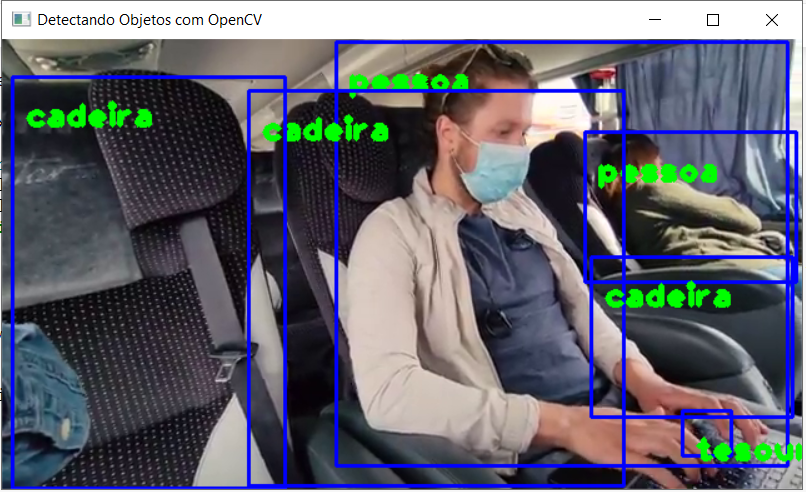

# Projeto de Detecção de Objetos Utilizando OpenCV

## Contexto

Este repositório contém um script em Python 3 utilizando a biblioteca OpenCV para reconhecer qualquer pessoa, veículo, objeto ou animais que aparecerem em um video ou imagem. O OpenCV é uma enorme biblioteca Open Source voltada para Visão Computacional, Machine Learning e Processamento de Imagens. Ao utilizar essa biblioteca, é possível criar uma variedade de projetos,  que vão desde a detecção de rostos e objetos, a classificação de ações humanas até o rastreamento de movimentos. 
 

---

## Sobre o código:

O código utiliza a biblioteca OpenCV para o processamento das imagens, o algoritmo de Deep Learning MobileNet para classificação dessas imagens e também o poderosíssimo dataset do COCO para a realização da detecção dos objetos. Atualmente esse conjunto de dados  COCO possui mais de 100k de imagens catalogadas em mais de 80 categorias diferentes de objetos, sendo uma ótima ferramenta de base para treinar modelos de visão computacional.

O código foi escrito no aplicativo web Jupyter Notebook, pois ele possui pré instalado as principais bibliotecas usadas no momento e dessa forma isso é muito útil para agilizar o processo de desenvolvimento. O Jupyter também permite organizar os códigos em células separadas, deixando o ambiente de desenvolvimento mais dinâmico e organizado, é possivel também  criar células de marcação, podendo adicionar títulos de diferentes tamanhos e textos dentro do seu arquivo de código.

